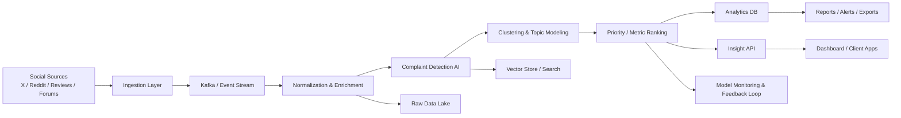

# Banking Complaints Intelligence Platform

## 1) System architecture



### Layers

1. Ingestion layer
   - Polls and collects public posts from social media and review sources.
   - Normalizes timestamps, author metadata, content, language, and platform metadata.

2. Stream processing layer
   - Receives events and deduplicates / enriches them.
   - Detects malformed or abusive content.

3. AI analysis layer
   - Detects complaints vs non-complaints.
   - Classifies topic, sentiment, urgency, and business impact.
   - Clusters similar complaints into thematic groups.

4. Ranking and prioritization layer
   - Scores complaints based on a user-defined business metric.
   - Produces ranked issue lists, alerts, and trend summaries.

5. Insight and reporting layer
   - Exposes an API for banks to query issues, trends, and recommendations.
   - Provides dashboards for executives, product teams, and support teams.

---

## 2) Data model

### Core entities

#### Post
- id
- source
- source_url
- author_handle
- platform
- text
- language
- created_at
- sentiment_score
- is_complaint
- complaint_topic
- processed_at

#### ComplaintIssue
- id
- cluster_id
- topic
- severity
- sentiment
- volume
- trend
- regulatory_risk
- business_impact
- priority_score
- first_seen_at
- last_seen_at

#### Cluster
- id
- name
- description
- centroid_embedding
- representative_posts
- size
- growth_rate

#### InsightReport
- id
- customer_id
- metric_name
- generated_at
- summary
- top_issues
- recommendations

### Example JSON

```json
{
  "id": "complaint-101",
  "source": "twitter",
  "source_url": "https://x.com/...",
  "text": "My bank app keeps declining my card and I can't transfer money.",
  "language": "en",
  "created_at": "2026-09-02T10:00:00Z",
  "sentiment_score": -0.92,
  "is_complaint": true,
  "complaint_topic": "card_declined",
  "severity": 5,
  "regulatory_risk": 0.9,
  "business_impact": 0.8,
  "priority_score": 0.87
}
```

---

## 3) AI ranking and grouping algorithm

### Complaint detection
- Use a classifier to decide: complaint / praise / neutral / spam / irrelevant
- Model input: post text, metadata, brand mentions, attention signals, and historical labels

### Topic clustering
- Use embeddings + clustering to group semantically similar issues
- Example topics:
  - card_declined
  - app_crash
  - transfer_delay
  - hidden_fees
  - account_lockout
  - support_wait_time

### Priority metric
A flexible score is computed as:

$$
score = w_1 \cdot severity + w_2 \cdot sentiment + w_3 \cdot volume + w_4 \cdot trend + w_5 \cdot regulatory\_risk + w_6 \cdot business\_impact
$$

with weights adjustable by the customer. Example default values:

- severity = 0.30
- sentiment = 0.25
- volume = 0.15
- trend = 0.10
- regulatory_risk = 0.10
- business_impact = 0.10

This allows one client to prioritize regulatory risk while another prioritizes churn and support burden.

---

## 4) API contract

### POST /insights/rank

Request:

```json
{
  "complaints": [
    {
      "topic": "card_declined",
      "severity": 5,
      "sentiment": -0.9,
      "volume": 120,
      "trend": 0.28,
      "regulatory_risk": 0.9,
      "business_impact": 0.8
    },
    {
      "topic": "app_crash",
      "severity": 4,
      "sentiment": -0.7,
      "volume": 90,
      "trend": 0.19,
      "regulatory_risk": 0.4,
      "business_impact": 0.7
    }
  ],
  "metric_weights": {
    "severity": 0.30,
    "sentiment": 0.25,
    "volume": 0.15,
    "trend": 0.10,
    "regulatory_risk": 0.10,
    "business_impact": 0.10
  }
}
```

Response:

```json
{
  "items": [
    {
      "topic": "card_declined",
      "severity": 5,
      "sentiment": -0.9,
      "volume": 120,
      "trend": 0.28,
      "regulatory_risk": 0.9,
      "business_impact": 0.8,
      "priority_score": 0.87
    }
  ]
}
```

### Additional useful endpoints
- GET /health
- GET /insights/demo
- GET /insights/topics
- GET /insights/trends
- GET /insights/alerts
- GET /insights/benchmark/{bank_id}

---

## Recommended frameworks and technologies

### Application services
- Python
- FastAPI
- Pydantic
- Uvicorn

### Streaming and ingestion
- Kafka
- Python workers or Azure Event Hubs

### Storage and search
- MySQL or MariaDB
- TimescaleDB (optional if you want time-series analytics)
- OpenSearch
- MySQL/MariaDB JSON + vector support via plugin or a separate vector store if needed

### AI / NLP
- Azure OpenAI or OpenAI
- LangChain
- sentence-transformers
- BERTopic
- scikit-learn

### Frontend
- React
- Next.js
- TypeScript
- Recharts / ECharts

### Infrastructure
- Docker
- Kubernetes
- Terraform
- Prometheus + Grafana

---

## Why this design works

- It scales to high-volume social data without blocking customer-facing analytics.
- It separates ingestion, classification, clustering, ranking, and API exposure.
- It allows each bank to configure its own metric of importance.
- It keeps the API monetizable, structured, and enterprise-ready.
